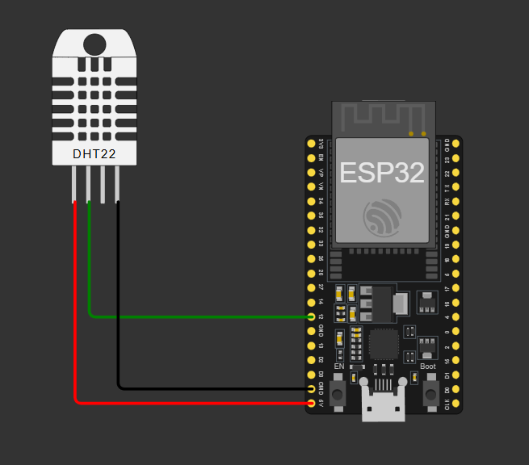

# 📝 Relatório Final 

>👤 **Dados do Candidato**
>- **Nome:** Sarah Mendes Teles 
>- **Github:** sarahmendes-ufca


## 1️⃣ Visão Geral da Solução - Sistema de Monitoramento de Ambiente: Monitoramento de Temperatura e Umidade com ESP32


Este projeto tem como objetivo de monitorrar o ambiente, realizando a leitura de temperatura e umidade utilizando um sensor DHT22 conectado a um ESP32, e
ambiente simulado no Wokwi.

O sistema embarcado coleta os dados do sensor periodicamente e os exibe no terminal serial. Ele simula um sistema básico de 
monitoramento ambiental, que pode ser expandido para aplicações reais como automação residencial ou controle climático.

A interação do usuário ocorre por meio da visualização dos dados no console da simulação.




---

## 2️⃣ Arquitetura do Sistema Embarcado

O sistema segue uma arquitetura simples baseada em loop contínuo.

### 🔁 Fluxo principal (`main.py`)

1. **Bibliotecas**
  - O código inicia com a importação das bibliotecas necessárias: Pin, da biblioteca machine, que permite controlar os pinos do ESP32; dht, responsável pela comunicação com o sensor DHT22; e time, utilizada para controle de temporização:
``` bash 
from machine import Pin
import dht
import time

dht_pin = Pin(12)
```

2. **Configurações**
- Foram definidas algumas configurações importantes do sistema, como o pino onde o sensor está conectado (PINO_DHT = 12), o intervalo entre as leituras (INTERVALO_LEITURA = 2000, em milissegundos) e o limite de temperatura para alerta (TEMP_ALERTA = 30). Essa separação em constantes facilita a manutenção e evita o uso de valores fixos espalhados pelo código:
``` bash
PINO_DHT = 12
INTERVALO_LEITURA = 2000  # ms
TEMP_ALERTA = 30
``` 

3. **Estados**
  - O sensor é inicializado associando o DHT22 ao pino configurado. Na sequência, são definidos os estados do sistema: normal, alerta e erro. Esses estados representam o comportamento do sistema em diferentes condições e caracterizam uma máquina de estados simples, onde o funcionamento não depende apenas da leitura, mas também da situação atual do sistema. Inicialmente, o sistema começa no estado normal.
``` bash 
# Estados
ESTADO_NORMAL = 0
ESTADO_ALERTA = 1
ESTADO_ERRO = 2


estado_atual = ESTADO_NORMAL


# Controle de tempo
ultimo_tempo = 0
```

4. **Funções**:
- A função *ler_sensor()* é responsável por tentar realizar a leitura do DHT22. Caso a leitura seja bem-sucedida, ela retorna a temperatura, a umidade e um valor booleano indicando sucesso. Caso ocorra algum erro, a função retorna valores nulos e um indicador de falha
```bash
def ler_sensor():
 """
 Realiza a leitura do DHT22.
 Retorna: (temperatura, umidade, sucesso)
 """
 try:
     sensor.measure()
     return sensor.temperature(), sensor.humidity(), True
 except Exception:
     return None, None, False
```
- A função *atualizar_estado()* define em qual estado o sistema deve estar com base nos dados recebidos: se houve erro na leitura, o estado passa a ser de erro; se a temperatura ultrapassa o limite definido, o sistema entra em alerta; caso contrário, permanece no estado normal.
```bash
def atualizar_estado(temp, leitura_ok):
    """
    Define o estado do sistema com base nos dados.
    """
    if not leitura_ok:
        return ESTADO_ERRO
    elif temp > TEMP_ALERTA:
        return ESTADO_ALERTA
    else:
        return ESTADO_NORMAL
```

- A função *exibir_dados()* organiza a saída no terminal, exibindo os valores de temperatura e umidade, além do estado atual do sistema de forma clara.
```bash
def exibir_dados(temp, hum, estado):
    """
    Exibe os dados no terminal de forma organizada.
    """
    print("\n-----------------------")

    if estado == ESTADO_ERRO:
        print("Erro ao ler sensor")

    else:
        print("Temperatura:", temp, "°C")
        print("Umidade:", hum, "%")

        if estado == ESTADO_ALERTA:
            print("Status: ALERTA (Temperatura alta)")
        else:
            print("Status: NORMAL")
```

5. **Fluxo principal**:
  - Após a configuração inicial, o programa imprime uma mensagem indicando que o sistema foi iniciado e entra em um loop infinito, que representa o funcionamento contínuo típico de sistemas embarcados. Dentro desse loop, o código obtém o tempo atual em milissegundos utilizando ticks_ms() e verifica se o intervalo definido já foi atingido desde a última leitura. Caso sim, ele atualiza a variável de controle de tempo, realiza a leitura do sensor, determina o estado do sistema e exibe os dados.
``` bash 
# Loop principal
print("Sistema iniciado")

while True:
    agora = time.ticks_ms()

    if time.ticks_diff(agora, ultimo_tempo) >= INTERVALO_LEITURA:
        ultimo_tempo = agora

        temp, hum, ok = ler_sensor()

        estado_atual = atualizar_estado(temp if temp is not None else 0, ok)

        exibir_dados(temp, hum, estado_atual)
```

### 📁 Estrutura de diretórios do projeto

```text
/project
 ├── src/
 │   └── main.py        # Código principal do projeto
 ├── wokwi.toml         # Configuração da simulação
 ├── diagram.json       # Circuito no Wokwi
 └── README.md          # Explicação do seu projeto
```

### ⏱️ Estrutura de execução

O sistema é baseado em um loop infinito (while True), característica típica de sistemas embarcados que operam continuamente. No entanto, ao invés de utilizar atrasos bloqueantes como sleep(), foi adotada uma abordagem de temporização não bloqueante com time.ticks_ms(), permitindo maior eficiência e possibilidade de expansão do sistema.

A execução segue um ciclo controlado por tempo:

- Verificação do tempo decorrido desde a última leitura
- Execução da leitura do sensor apenas quando o intervalo é atingido
- Processamento e exibição dos dados

Além disso, o sistema implementa tratamento de erros estruturado, encapsulado em funções, garantindo que falhas na leitura do sensor não interrompam a execução do programa.

### 🔗 Interação entre componentes

O funcionamento do sistema ocorre da seguinte forma:

- O ESP32 envia um comando de leitura ao sensor DHT22
- O DHT22 realiza a medição e retorna os dados de temperatura e umidade
- O ESP32 processa essas informações
- O sistema classifica o estado (normal, alerta ou erro)
- Os dados e o estado são exibidos no terminal

Essa separação entre leitura, decisão e saída segue uma arquitetura mais organizada e próxima de sistemas embarcados reais.
---

## 3️⃣ Componentes Utilizados na Simulação

**ESP32**
- Microcontrolador responsável por executar o firmware, gerenciar a lógica do sistema e processar os dados recebidos do sensor.

**DHT22 (sensor de temperatura e umidade)**

- Dispositivo digital que fornece medições de temperatura (°C) e umidade relativa do ar (%), utilizado como fonte de dados do sistema.

**Resistor de 10kΩ (pull-up)**

- Essencial para garantir a estabilidade do sinal de comunicação entre o ESP32 e o DHT22, conectado entre VCC e o pino de dados.

**Jumpers (fios)**

- Responsáveis pela interligação elétrica entre os componentes.

**📌 Conexões principais:**
- VCC → 3.3V do ESP32
- GND → GND do ESP32
- DATA → GPIO 12 (ou outro pino digital configurado)

## 4️⃣ Decisões Técnicas Relevantes

* **Uso da biblioteca `dht`**

  * Facilita a comunicação com o sensor sem precisar implementar o protocolo manualmente

* **Estrutura simples com loop infinito**

  * Adequada para sistemas embarcados que executam continuamente

* **Tratamento de exceções (`try/except`)**

  * Evita que o programa trave caso haja falha na leitura do sensor

* **Intervalo de leitura (2 segundos)**

  * Necessário devido à limitação do DHT22, que não suporta leituras muito frequentes

---

## 5️⃣ Resultados Obtidos

O sistema conseguiu:

- Ler corretamente os valores de temperatura e umidade
- Exibir os dados no terminal da simulação
- Manter execução contínua sem travamentos

### ✅ Requisitos atendidos:

- Comunicação com sensor DHT22
- Processamento de dados no ESP32
- Exibição dos resultados

Na simulação do Wokwi, os valores são atualizados periodicamente e refletem o comportamento esperado do sensor.

---

## 6️⃣ Comentários Adicionais

### ⚠️ Dificuldades encontradas

- Erros iniciais de leitura do sensor

### 🚧 Limitações

- Sistema apenas exibe dados (não armazena nem envia)
- Sem interface gráfica ou comunicação externa

### 🚀 Melhorias futuras

- Envio dos dados via Wi-Fi (MQTT ou HTTP)
- Integração com dashboard (ex: Node-RED)
- Uso de display LCD/OLED

### 📚 Aprendizados

- Integração de sensores com microcontroladores
- Importância de detalhes elétricos (pull-up)
- Estrutura básica de sistemas embarcados em MicroPython

---
